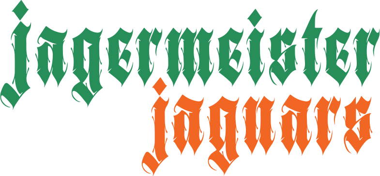

<h2 align="center">
  Welcome to Planning Poker! <br/>
  <a href="https://planning-poker-beta.vercel.app/" target="_blank">Check it out on Web</a>
</h2>
<div align="center">
  
</div>

# 📝 Description

- **Planning Poker** is a real-time, multiplayer estimation tool for agile teams. Built with Angular 19 and Firebase, it allows you to create and join rooms, customize voting cards, and see live player activity. All with a modern, playful UI and blazing-fast performance.

# 🗃️ Technologies Used

- **Angular 19** for modern SPA structure
- **TypeScript** for robust, scalable code
- **SCSS** for custom, responsive styles
- **Firebase** for real-time database & hosting
- **PrimeNG** for elegant UI components (tooltips, dialogs, toasts)
- **HTML** for semantic structure
- **Shared Components:** Implements reusable UI components, to ensure consistency and reduce redundancy throughout the application.

# 💡 Features

- **Lobby**: Quick access to Create Room, Join Room, or see All Active Rooms.
- **Create Room**: Make a new room with your name and either a default or custom set of voting cards.
- **Join Room**: Enter your name and a room name to jump right into an estimation session.
- **All Rooms**: View a real-time list of all active rooms and see how many players are online in each.
- **Voting**: In a room, select or remove your vote, see who has voted, and reveal or clear all votes with a single click.
- **Live Updates**: Player list, room list, and vote counts update instantly for all users.
- **Fun UI**: Modern, responsive layout, playful empty states, and team-inspired styling.

# ✅ Getting Started

1. Clone the Planning Poker [GitHub repository](https://github.com/TihomirDenev/PlanningPoker) locally:

```bash
https://github.com/TihomirDenev/PlanningPoker.git
```

2. Navigate to the project directory:

```bash
cd PlanningPoker
```

3. Install Dependencies Before running the project.

```bash
npm install --legacy-peer-deps
```

4. To run the project, use the following command:

```bash
npm run start
```

5. Open localhost link in browser to view web-platform.

# ▶️ How It Works

- Go to the Lobby and choose to create a room or join an existing one.
- In a room, invite teammates and start voting!
- Reveal, clear, and discuss votes in real-time.

# ✨ Contributing

- We welcome contributions to Planning Poker! If you have suggestions or want to help, open an issue or submit a pull request. Please follow the contribution guidelines for a smooth collaboration.

# 📇 License

- This project is licensed under the [MIT License](https://opensource.org/licenses/MIT).
